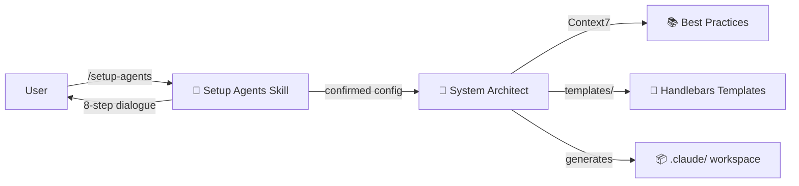
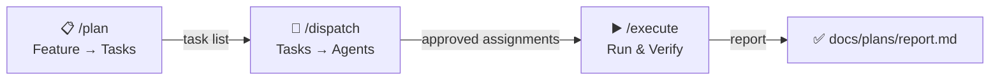

<div align="center">

# ⚒️ Forgeline

**Scaffold a production-ready multi-agent development system for any project**

From vision to a fully configured Claude Code workspace — in minutes, not hours.

[](LICENSE)
[](https://github.com/nikita-voloshyn/forgeline)
[](CHANGELOG.md)
[](CHANGELOG.md)
[](CONTRIBUTING.md)

<sub>Beta — core dialogue, agent architecture, and templates are in place. Expect breaking changes before v1.0.</sub>

[Report Bug](https://github.com/nikita-voloshyn/forgeline/issues/new?template=bug_report.md) · [Request Feature](https://github.com/nikita-voloshyn/forgeline/issues/new?template=feature_request.md) · [Contributing](CONTRIBUTING.md)

</div>

---

## ✨ What It Does

Forgeline reads your project files, runs an interactive 8-step dialogue, and generates a complete multi-agent system tailored to your stack:

- **🤖 Specialized Agents** — domain agents (backend, frontend, testing, ops) with strict boundaries
- **⚡ Task Orchestration** — `/plan` → `/dispatch` → `/execute` pipeline for structured feature development
- **🧭 Development Approach** — choose Iterative, Shape Up, TDD, Trunk-Based, or YAGNI
- **🛠️ Custom Skills** — `/check`, `/changelog`, `/phase`, `/deploy-check` + stack-specific commands
- **🔌 Plugins** — Context7 always included, others recommended per stack
- **🪝 Hooks** — auto-linting on save, safety scans on stop
- **🔐 Permissions** — allow/deny pre-configured, ready to extend
- **📖 Full Docs** — `agentic-system.md`, `development-plan.md`, `commands.md` auto-generated

### Without Forgeline vs With Forgeline

```
❌ Manually read project files              ✅ /setup-agents
❌ Define agents one by one                 ✅ 8-step interactive dialogue
❌ Write CLAUDE.md from scratch             ✅ Auto-generated with approach & rules
❌ Configure skills, hooks, permissions     ✅ Stack-aware defaults, you adjust
❌ 2-4 hours per project                    ✅ 5-10 minutes
```

---

## 🚀 Quick Start

```bash
# 1. Install the plugin
/plugin marketplace add nikita-voloshyn/forgeline
/plugin install nikita-voloshyn/forgeline

# 2. Navigate to any project and run
/setup-agents

# 3. After setup, use orchestration for feature development
/plan       # Decompose a feature into tasks
/dispatch   # Assign agents to tasks, review and approve
/execute    # Execute tasks one by one with verification
```

---

## 🏗️ Architecture

Forgeline follows a strict **skill + agent** separation:

### Setup Phase



### Development Phase



| Component | Role | Model |
|-----------|------|-------|
| `/setup-agents` skill | Interactive dialogue, user confirmation | runs in user session |
| `system-architect` agent | File analysis, Context7 lookups, generation | opus |
| `dispatch` agent | Task assignment within orchestration pipeline | generated per-project |
| `docs` agent | Documentation coverage — audit, update, status | generated per-project |
| `templates/` | Source of truth for all generated content | Handlebars |

---

## 📥 Input Files

Forgeline auto-detects your project from these files:

| Priority | Files |
|----------|-------|
| 🥇 Primary | `vision.md` + `tech-stack.md` |
| 🥈 Fallback | `README.md`, `package.json`, `Cargo.toml`, `pyproject.toml`, etc. |

---

## 📦 What Gets Generated

```
.claude/
├── 🔧 settings.json              — plugins, hooks, deny permissions
└── 🔐 settings.local.json        — allow permissions, MCP servers

agents/
├── 🤖 *.md                       — domain agents (backend, frontend, testing, etc.)
├── 🎯 dispatch.md                — task assignment agent
└── 📖 docs.md                    — documentation coverage agent

skills/*/SKILL.md                  — /check, /changelog, /phase, /deploy-check,
                                     /plan, /dispatch, /execute, /docs,
                                     /setup-approach, + stack-specific

CLAUDE.md                          — architecture rules + approach + workflow

docs/
├── 📖 agentic-system.md          — full system documentation with diagrams
├── 📅 development-plan.md        — phase tracker (approach-adapted)
├── 📚 commands.md                — command reference
├── 📋 plans/                     — feature plans, dispatches, and reports
├── 📂 components/                — per-component documentation (maintained by docs agent)
└── 🧭 approaches-reference.md   — all 5 approaches for /setup-approach
```

---

## 🔧 Configuration Dialogue

Forgeline walks you through 8 steps before generating anything:

| Step | What | Details |
|------|------|---------|
| **1** | 📖 Project Understanding | Confirms what it read from your files |
| **2** | 🧭 Development Approach | Iterative, Shape Up, TDD, Trunk-Based, or YAGNI |
| **3** | 🤖 Agents | Proposes agents based on your stack — you adjust |
| **4** | ⚡ Skills | Standard set (9 skills) + stack-specific additions |
| **5** | 🔌 Plugins | Context7 always on, others recommended by stack |
| **6** | 🪝 Hooks | PostToolUse linting + Stop safety scan |
| **7** | 🔐 Permissions | allow/deny pre-filled — you extend |
| **8** | ✅ Final Confirmation | Full summary before generation |

---

## 🤝 Contributing

See [CONTRIBUTING.md](CONTRIBUTING.md) for development setup and guidelines.

## 🔒 Security

To report vulnerabilities, see [SECURITY.md](SECURITY.md).

## 📄 License

This project is licensed under the [MIT License](LICENSE).
