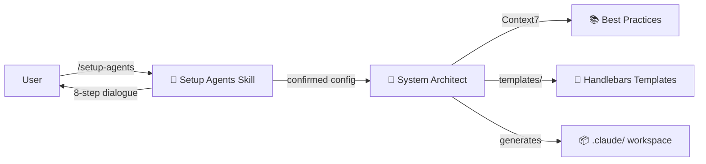
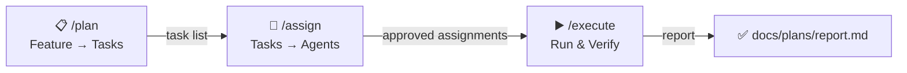

<div align="center">

# ⚒️ Forgeline

**Scaffold a multi-agent AI development system for any project — in minutes.**

[](LICENSE)
[](https://github.com/nikita-voloshyn/forgeline)
[](CHANGELOG.md)
[](CONTRIBUTING.md)

[Report Bug](https://github.com/nikita-voloshyn/forgeline/issues/new?template=bug_report.md) · [Request Feature](https://github.com/nikita-voloshyn/forgeline/issues/new?template=feature_request.md) · [Contributing](CONTRIBUTING.md)

</div>

---

## What is Forgeline?

Forgeline is a plugin for Claude Code that builds a complete AI development system for your project. You run one command, answer 8 questions, and it generates 50+ files: specialized AI agents for each part of your codebase, workflow commands, documentation, and a structured task pipeline — tailored to your tech stack.

```
❌ Manually read project files              ✅ /setup-agents
❌ Define agents one by one                 ✅ 8-step interactive dialogue
❌ Write CLAUDE.md from scratch             ✅ Auto-generated with approach & rules
❌ Configure skills, hooks, permissions     ✅ Stack-aware defaults, you adjust
❌ 2-4 hours per project                    ✅ 5-10 minutes
```

---

## What is Claude Code?

Claude Code is a terminal-based AI coding assistant made by Anthropic. It runs in your project directory and can read, write, and reason about your entire codebase.

[Official Claude Code documentation →](https://docs.anthropic.com/en/docs/claude-code)

---

## Prerequisites

- **Claude Code** installed and running ([installation guide](https://docs.anthropic.com/en/docs/claude-code/getting-started))
- An active **Claude subscription** (Claude Code requires a Claude account)
- A **project directory** — any existing codebase, or an empty folder

No build tools needed. Forgeline is a pure Claude Code plugin — no Node.js, no compilation.

---

## Installation

Run these commands inside Claude Code (not in a terminal shell):

```bash
# Add the plugin from the marketplace (downloads it to your local Claude Code)
/plugin marketplace add nikita-voloshyn/forgeline

# Activate it in your current session
/plugin install nikita-voloshyn/forgeline
```

---

## Your first run

Navigate to your project directory and run `/setup-agents`.

Forgeline starts by reading your project files and confirming what it found:

```
Step 1 — Project Understanding
──────────────────────────────
Project: my-saas-app
Type: Web application
Languages: TypeScript
Frameworks: Next.js 14, Prisma, PostgreSQL
Package manager: pnpm

Is this correct? [yes / correct it]
```

Steps 2–7 follow the same pattern — Forgeline proposes, you confirm or adjust:
approach → agents → skills → plugins → hooks → permissions.

Step 8 shows everything at once before writing a single file:

```
Step 8 — Confirm
────────────────
Approach: Iterative + Timeboxing
Agents: backend, frontend, database, testing, infra
Skills: /check, /changelog, /plan, /assign, /execute, /docs, /setup-approach ...
Hooks: Biome auto-lint on save, secrets scan on stop
Permissions: allow pnpm/git/gh pr, deny .env/secrets

Generate? [yes / change]
```

After confirming, the `system-architect` agent reads your files, queries current best-practice documentation via Context7, and generates ~50+ files. **Nothing is written until Step 8.**

---

## After setup — the development loop

Once your workspace is generated, use the three-step pipeline for any new feature:

```
/plan "Add user authentication with GitHub OAuth"
      → Decomposes the feature into tasks with domain assignments
      → Creates docs/plans/auth-plan.md

/assign
      → Review and approve which agent handles each task
      → Creates docs/plans/auth-dispatch.md

/execute
      → Runs each task in sequence, one agent per task
      → Verifies before proceeding to the next
      → Creates docs/plans/auth-report.md
```

All artifacts are saved in `docs/plans/` — you can resume mid-pipeline across sessions.

---

## 📦 What gets generated

After Step 8, the `system-architect` agent generates these files directly into your project:

```
.claude/
├── 🔧 settings.json              — plugins, hooks, deny permissions
└── 🔐 settings.local.json        — allow permissions, MCP servers

.claude/agents/
├── 🤖 *.md                       — domain agents (backend, frontend, testing, etc.)
├── 🎯 dispatch.md                — task assignment agent
└── 📖 docs.md                    — documentation coverage agent

.claude/skills/*/SKILL.md         — /check, /changelog, /phase, /deploy-check,
                                     /plan, /assign, /execute, /docs,
                                     /setup-approach, + stack-specific

CLAUDE.md                          — architecture rules + approach + workflow

docs/
├── 📖 agentic-system.md          — full system documentation with diagrams
├── 📅 development-plan.md        — phase tracker (approach-adapted)
├── 📚 commands.md                — command reference
├── 📋 plans/                     — feature plans, dispatches, and reports
├── 📂 components/                — per-component documentation (maintained by docs agent)
└── 🧭 approaches-reference.md   — all 5 approaches for /setup-approach
```

---

## 🔧 Configuration Dialogue

Forgeline walks you through 8 steps before generating anything:

| Step | What | Details |
|------|------|---------|
| **1** | 📖 Project Understanding | Confirms what it read from your files |
| **2** | 🧭 Development Approach | Iterative, Shape Up, TDD, Trunk-Based, or YAGNI |
| **3** | 🤖 Agents | Proposes agents based on your stack — you adjust |
| **4** | ⚡ Skills | Standard set (9 skills) + stack-specific additions |
| **5** | 🔌 Plugins | Context7 always on, others recommended by stack |
| **6** | 🪝 Hooks | PostToolUse linting + Stop safety scan |
| **7** | 🔐 Permissions | allow/deny pre-filled — you extend |
| **8** | ✅ Final Confirmation | Full summary before generation |

---

## 📥 Input Files

Forgeline auto-detects your project from these files:

| Priority | Files |
|----------|-------|
| 🥇 Primary | `vision.md` + `tech-stack.md` |
| 🥈 Fallback | `README.md`, `package.json`, `Cargo.toml`, `pyproject.toml`, etc. |

For best results, add a `vision.md` (what your project is and who it's for) and a `tech-stack.md` (languages, frameworks, tooling). See `tests/fixture/` in this repo for an example.

---

## How it works under the hood

Forgeline separates concerns cleanly: the skill handles the dialogue, the agent handles all file reading, analysis, and generation. Nothing is written until you confirm in Step 8.

### Setup Phase



The skill never writes files — it only gathers configuration and hands it to the agent.

### Development Phase



Each plan is a markdown file you can read, edit, or discard at any point.

| Component | Role | Model |
|-----------|------|-------|
| `/setup-agents` skill | Interactive dialogue, user confirmation | runs in user session |
| `system-architect` agent | File analysis, Context7 lookups, generation | opus |
| `dispatch` agent | Task assignment within orchestration pipeline | generated per-project |
| `docs` agent | Documentation coverage — audit, update, status | generated per-project |
| `templates/` | Source of truth for all generated content | Handlebars |

---

## 🤝 Contributing

See [CONTRIBUTING.md](CONTRIBUTING.md) for development setup and guidelines.

## 🔒 Security

To report vulnerabilities, see [SECURITY.md](SECURITY.md).

## 📄 License

This project is licensed under the [MIT License](LICENSE).
