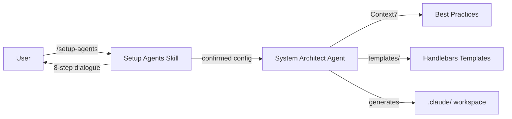

# Forgeline

[](LICENSE)
[](https://github.com/nikita-voloshyn/forgeline)
[](CHANGELOG.md)
[](CHANGELOG.md)

> Scaffold a production-ready multi-agent development system for any project — from vision to a fully configured Claude Code workspace.
>
> **Beta:** Forgeline is under active development. The core dialogue, agent architecture, and Handlebars templates are in place. Expect breaking changes before v1.0.

## What It Does

Forgeline reads your project's `vision.md` and `tech-stack.md` (or falls back to `README.md`, `package.json`, `Cargo.toml`, etc.), runs a detailed interactive dialogue, and generates a complete agent system tailored to your stack:

- Specialized agents with strict domain boundaries
- Custom skills (`/check`, `/changelog`, `/phase`, `/deploy-check`, `/plan`, `/dispatch`, `/execute`, and more)
- Task orchestration pipeline: `/plan` → `/dispatch` → `/execute` for structured feature development
- Development approach selection (Iterative, Shape Up, TDD, Trunk-Based, YAGNI)
- Plugins configured for your tech stack (Context7 always included)
- Hooks for auto-linting and safety scans
- Permissions pre-configured (allow + deny)
- Full documentation: `agentic-system.md`, `development-plan.md`, `commands.md`

## Architecture

Forgeline follows a strict **skill + agent** separation:



| Component | Role | Model |
|-----------|------|-------|
| `/setup-agents` skill | Interactive dialogue, user confirmation | runs in user session |
| `system-architect` agent | File analysis, Context7 lookups, generation | claude-opus-4-6 |
| `templates/` | Source of truth for all generated content | N/A |

## Installation

```bash
/plugin marketplace add nikita-voloshyn/forgeline
```

## Usage

Navigate to any project and run:

```bash
/setup-agents
```

Forgeline will read your project, walk you through an 8-step configuration dialogue, and generate the full agent system in place.

After setup, use the orchestration pipeline for feature development:

```bash
/plan       # Decompose a feature into tasks
/dispatch   # Assign agents to tasks, review and approve
/execute    # Execute tasks one by one with verification
```

## Input Files

| Priority | Files |
|----------|-------|
| Primary | `vision.md` + `tech-stack.md` |
| Fallback | `README.md`, `package.json`, `Cargo.toml`, `pyproject.toml`, etc. |

## What Gets Generated

```
.claude/
├── settings.json        — plugins, hooks, deny permissions
└── settings.local.json  — allow permissions, MCP servers

agents/
├── *.md                 — domain agents (backend, frontend, testing, etc.)
└── dispatch.md          — task assignment agent

skills/*/SKILL.md        — /check, /changelog, /phase, /deploy-check,
                            /plan, /dispatch, /execute, + stack-specific

CLAUDE.md                — architecture rules + approach + workflow
docs/
├── agentic-system.md    — full system documentation with diagrams
├── development-plan.md  — phase tracker (approach-adapted)
├── commands.md          — command reference
└── plans/               — feature plans, dispatches, and reports
```

## Configuration Dialogue

Forgeline walks you through 8 steps before generating anything:

1. **Project understanding** — confirms what it read from your files
2. **Development approach** — select a methodology (Iterative, Shape Up, TDD, Trunk-Based, YAGNI)
3. **Agents** — proposes agents based on your stack, you adjust
4. **Skills** — standard set (7 skills) + stack-specific additions
5. **Plugins** — Context7 always on, others recommended by stack
6. **Hooks** — PostToolUse linting + Stop safety scan
7. **Permissions** — allow/deny pre-filled, you extend
8. **Final confirmation** — full summary before generation

## Contributing

See [CONTRIBUTING.md](CONTRIBUTING.md) for development setup and guidelines.

## Security

To report vulnerabilities, see [SECURITY.md](SECURITY.md).

## License

This project is licensed under the [MIT License](LICENSE).
