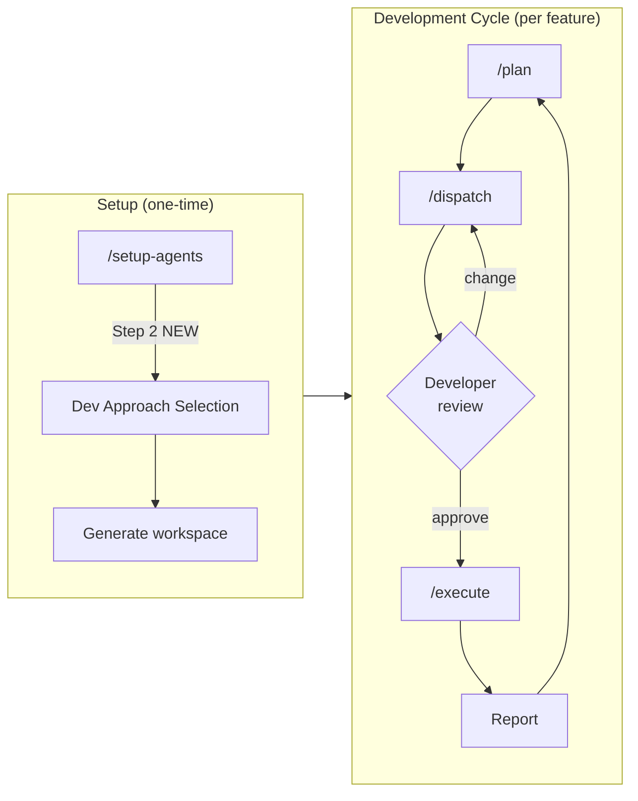
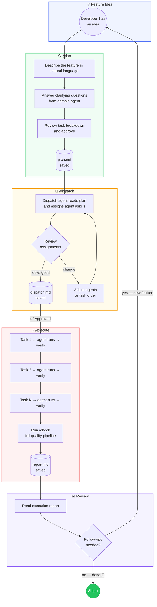
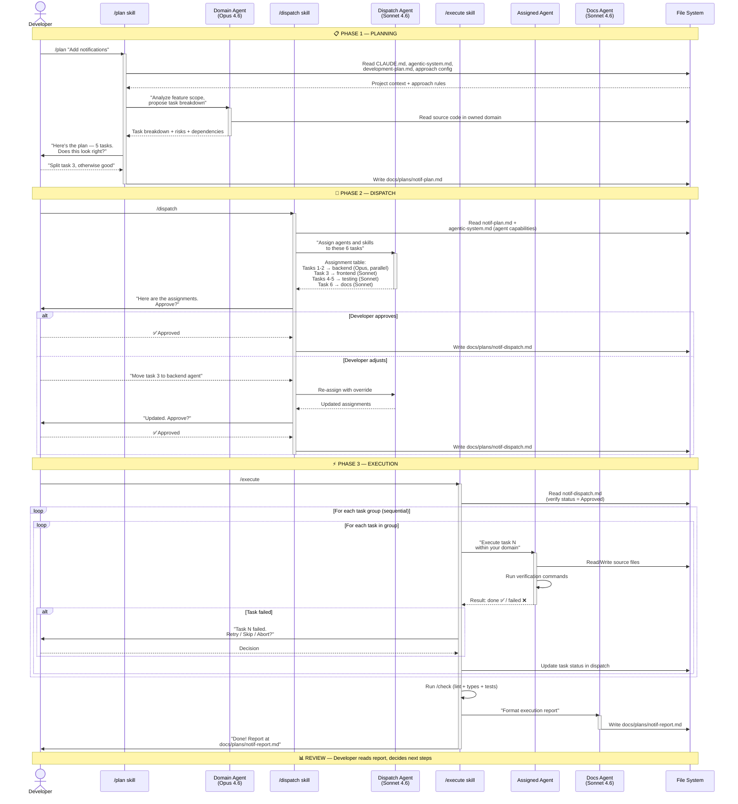
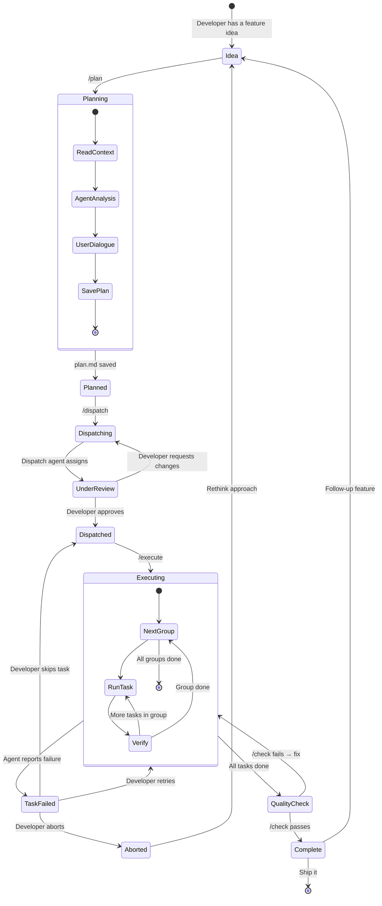
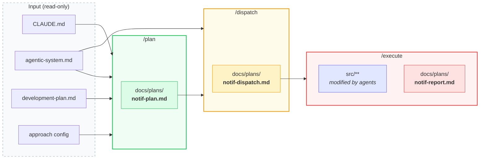

# Forgeline — Post-Setup Orchestration & Development Approach

**Date:** 2026-03-23
**Status:** Draft
**Depends on:** [Forgeline Design Spec (2026-03-22)](2026-03-22-forgeline-design.md)

---

## Problem

After `/setup-agents` generates the workspace, the developer is left with agents, skills, and docs — but no structured workflow for day-to-day feature development. The current `/phase` skill reads a static plan and executes linearly. This breaks down in practice:

- Developers manually decompose features into tasks
- Agent assignment is implicit ("figure out who does what")
- No audit trail — what was planned vs. what was executed
- Development methodology is hardcoded (waterfall-ish phases)

---

## Solution Overview

Two new systems that work together:

1. **Task Orchestration** — a 3-skill pipeline (`/plan` → `/dispatch` → `/execute`) that structures feature development into plan → assign → run → report
2. **Development Approach Layer** — a new step in the `/setup-agents` dialogue that lets the user pick a methodology, adapting all generated output



---

## Part 1: Task Orchestration System

### Core Principle

**Nothing executes without manual approval.** The system automates the boring parts (decomposition, assignment, progress tracking) while the developer stays in control at every transition.

### The Pipeline

```
/plan                    /dispatch                  /execute
┌──────────────┐        ┌──────────────┐           ┌──────────────┐
│ User + Agent │───────▶│ Dispatch     │──review──▶│ Task-by-task │
│ create plan  │        │ Agent assigns│           │ execution    │
│              │        │ agents/skills│           │              │
│ Output:      │        │ Output:      │           │ Output:      │
│ plan.md      │        │ dispatch.md  │           │ report.md    │
└──────────────┘        └──────────────┘           └──────────────┘
```

---

### `/plan` — Planning Session

**Purpose:** User and a domain agent collaborate to produce a human-readable feature plan.

**Input:** Feature description (free text from developer)

**Process:**

1. Read project context:
   - `CLAUDE.md` — architecture rules and constraints
   - `docs/agentic-system.md` — available agents and their domains
   - `docs/development-plan.md` — current phase and progress
   - Selected development approach config (if present)

2. Identify the relevant domain agent based on feature scope (e.g., backend feature → backend agent, full-stack → multiple agents listed)

3. Collaboratively decompose the feature:
   - Ask clarifying questions about scope, edge cases, dependencies
   - Propose task breakdown
   - User confirms or adjusts

4. Write the plan to `docs/plans/<feature-slug>-plan.md`

**Output format:**

```markdown
# Plan: <Feature Name>

**Date:** <YYYY-MM-DD>
**Author:** <developer> + <domain agent>
**Approach:** <selected methodology>
**Phase:** <current development phase>

## Goal

<1-2 sentences: what this feature achieves>

## Tasks

| # | Task | Domain | Depends on | Acceptance criteria |
|---|------|--------|------------|---------------------|
| 1 | ... | backend | — | ... |
| 2 | ... | frontend | 1 | ... |
| 3 | ... | testing | 1, 2 | ... |

## Risks

- <risk 1: what could go wrong and mitigation>

## Out of scope

- <what this feature explicitly does NOT include>
```

**Key rules:**
- The plan is human-readable, not machine-parseable — developers review it as a document
- Tasks must be small enough to complete in one Claude session
- Each task has a single domain owner (maps to one agent)
- Dependencies are explicit — no implicit ordering
- The approach config influences task structure (see Part 2)

---

### `/dispatch` — Agent/Skill Assignment

**Purpose:** Translate the human plan into a machine-readable dispatch with concrete agent and skill assignments.

**Input:** An existing `<feature>-plan.md` file

**Process:**

1. Read the plan from `docs/plans/<feature>-plan.md`

2. Read system capabilities:
   - `docs/agentic-system.md` — agent names, domains, models, verification commands
   - Available skills and their triggers

3. Delegate to the **dispatch agent** (see New Agents below)

4. Dispatch agent produces assignments:
   - For each task: which agent executes, which skills run before/after
   - Execution order respecting dependencies from the plan
   - Parallel groups — tasks with no mutual dependencies that can run simultaneously
   - Estimated model usage (Opus vs Sonnet per task)

5. **GATE: Present dispatch for developer review**
   - Show the full assignment table
   - Highlight any decisions that need human input (ambiguous domain, conflicting dependencies)
   - Wait for explicit approval

6. On approval: save to `docs/plans/<feature>-dispatch.md`

**Output format:**

```markdown
# Dispatch: <Feature Name>

**Plan:** `<feature>-plan.md`
**Date:** <YYYY-MM-DD>
**Status:** Approved | Pending

## Execution Order

### Group 1 (parallel)

| Task | Agent | Model | Pre-skills | Post-skills | Est. tokens |
|------|-------|-------|------------|-------------|-------------|
| 1. Setup DB schema | backend | opus | — | /check | ~5k |
| 2. Create API types | backend | opus | — | — | ~3k |

### Group 2 (after Group 1)

| Task | Agent | Model | Pre-skills | Post-skills | Est. tokens |
|------|-------|-------|------------|-------------|-------------|
| 3. Implement endpoints | backend | opus | — | /check | ~10k |
| 4. Frontend components | frontend | sonnet | — | /check | ~8k |

### Group 3 (after Group 2)

| Task | Agent | Model | Pre-skills | Post-skills | Est. tokens |
|------|-------|-------|------------|-------------|-------------|
| 5. Integration tests | testing | sonnet | — | /check | ~6k |

## Notes

- <dispatch agent's reasoning for non-obvious assignments>
```

**Key rules:**
- Dispatch agent NEVER modifies the plan — it only assigns executors
- If a task doesn't map cleanly to one agent, dispatch agent flags it for the developer
- Groups define parallelism: tasks in the same group have no dependencies on each other
- Developer can reassign any task before approving

---

### `/execute` — Guided Execution

**Purpose:** Run the approved dispatch plan task by task, producing a full execution report.

**Input:** An approved `<feature>-dispatch.md` file

**Process:**

1. Read dispatch from `docs/plans/<feature>-dispatch.md`
2. Verify status is `Approved` — refuse to run `Pending` dispatches

3. Execute groups in order:
   ```
   For each group:
     For each task in group:
       1. Log: "Starting task N: <description>"
       2. Run pre-skills (if any)
       3. Invoke the assigned agent within its domain scope
       4. Agent performs the work and runs its own verification
       5. Run post-skills (if any)
       6. Record: status (done/failed), files changed, verification output
       7. If failed → STOP, report failure, ask developer how to proceed:
          - Retry the task
          - Skip and continue
          - Abort execution
   ```

4. After all tasks complete:
   - Run `/check` (full quality pipeline)
   - Generate execution report
   - Save to `docs/plans/<feature>-report.md`

**Output format:**

```markdown
# Report: <Feature Name>

**Plan:** `<feature>-plan.md`
**Dispatch:** `<feature>-dispatch.md`
**Date:** <YYYY-MM-DD>
**Status:** Complete | Partial | Failed

## Results

| # | Task | Agent | Status | Files changed | Notes |
|---|------|-------|--------|---------------|-------|
| 1 | Setup DB schema | backend | Done | 2 | — |
| 2 | Create API types | backend | Done | 1 | — |
| 3 | Implement endpoints | backend | Done | 3 | Added validation |
| 4 | Frontend components | frontend | Done | 4 | — |
| 5 | Integration tests | testing | Done | 2 | 12 tests added |

## Quality Check

- Lint: pass
- Types: pass
- Tests: 47/47 passing

## Summary

<2-3 sentences: what was built, any deviations from the plan>

## Follow-up

- <any tasks that surfaced during execution and should be planned next>
```

**Key rules:**
- Execution is sequential within groups, parallel groups execute in order (not concurrently — Claude Code runs one session)
- Every task records what files it changed — this is the audit trail
- Failed tasks do NOT automatically retry — developer decides
- The report is the single source of truth for what happened

---

### New Agents (Generated in Target Project)

#### Dispatch Agent

```yaml
name: dispatch
model: claude-sonnet-4-6
domain: "Task assignment and execution planning"
```

**Core Directives:**
1. Read the plan and the agentic-system.md to understand available agents
2. Assign each task to exactly one agent based on domain ownership
3. Group tasks by dependency level for ordered execution
4. Never modify the plan content — only add execution metadata
5. Flag ambiguous assignments for developer decision

**Owns:** `docs/plans/*-dispatch.md`
**Forbidden from:** source code, configs, agent definitions

**Why Sonnet:** This is a routing/coordination task, not safety-critical generation. Speed matters more than depth.

#### Documentation Agent

```yaml
name: docs
model: claude-sonnet-4-6
domain: "Plan and report formatting, system documentation"
```

**Core Directives:**
1. Format all plans and reports as clean, consistent markdown
2. Maintain `docs/agentic-system.md` when the system changes
3. Generate Mermaid diagrams for architecture visualization
4. Never modify source code or configuration

**Owns:** `docs/plans/`, `docs/agentic-system.md`, `docs/commands.md`
**Forbidden from:** source code, agents/, skills/, .claude/

**Why Sonnet:** Documentation is high-iteration, not safety-critical.

---

### New Templates (in Forgeline)

```
templates/
├── agents/
│   ├── dispatch.md.hbs          — dispatch agent definition
│   └── docs.md.hbs              — documentation agent definition
├── skills/
│   ├── plan.md.hbs              — /plan skill
│   ├── dispatch.md.hbs          — /dispatch skill
│   └── execute.md.hbs           — /execute skill
└── plans/
    ├── plan.md.hbs              — plan document format
    ├── dispatch.md.hbs          — dispatch document format
    └── report.md.hbs            — execution report format
```

**Template variables (new):**

| Variable | Source | Used in |
|----------|--------|---------|
| `{{approach}}` | Step 2 dialogue | plan.md.hbs, skills |
| `{{approachConfig}}` | approach template | plan, dispatch, execute skills |
| `{{dispatchAgent}}` | auto-generated | dispatch.md.hbs |
| `{{docsAgent}}` | auto-generated | docs.md.hbs |

---

### File Structure in Target Project (After Generation)

```
docs/
├── agentic-system.md            — updated with dispatch + docs agents
├── development-plan.md          — adapted to selected approach
├── commands.md                  — updated with /plan, /dispatch, /execute
└── plans/                       — NEW: feature planning directory
    ├── <feature>-plan.md        ← /plan output
    ├── <feature>-dispatch.md    ← /dispatch output
    └── <feature>-report.md      ← /execute output
```

---

### Modified Existing Components

#### `/phase` → superseded by `/plan` + `/dispatch` + `/execute`

The current `/phase` skill (linear executor) is replaced by the 3-skill pipeline. Migration:

- `phase.md.hbs` is refactored to become a thin wrapper:
  1. If `docs/plans/` has a pending dispatch → run `/execute`
  2. If no dispatch exists → prompt to run `/plan` first
  3. Maintains backward compatibility for projects that haven't adopted orchestration

#### `setup-agents/SKILL.md`

- Standard skill set expands: `/check`, `/changelog`, `/phase`, `/deploy-check` + **`/plan`, `/dispatch`, `/execute`**
- Step 7 summary includes orchestration workflow description
- System architect generates dispatch + docs agents alongside domain agents

#### `system-architect.md`

- Generation output adds `agents/dispatch.md`, `agents/docs.md`
- Generation output adds 3 new skills
- Generation output adds `docs/plans/` directory
- Updated verification checklist includes orchestration files

#### `agentic-system.md.hbs`

- New section: "Development Workflow" with orchestration diagram
- Dispatch and docs agents in the agents table
- `/plan`, `/dispatch`, `/execute` in the skills table

#### `CLAUDE.md.hbs`

- New section: "Development Workflow" explaining the plan → dispatch → execute lifecycle
- Reference to `docs/plans/` as the audit trail

---

## Part 2: Development Approach Layer

### Core Principle

**The methodology shapes the output, not the process.** The 7-step dialogue (now 8-step) stays the same. The selected approach changes what gets generated — phases, skill behavior, hooks, and orchestration constraints.

---

### New Step in Dialogue: Step 2 — Development Approach

Inserted before the current Step 2 (Agents). The full dialogue becomes:

```
Step 1 — Project Understanding       (unchanged)
Step 2 — Development Approach         NEW
Step 3 — Agents                       (was Step 2)
Step 4 — Skills                       (was Step 3)
Step 5 — Plugins                      (was Step 4)
Step 6 — Hooks                        (was Step 5)
Step 7 — Permissions                  (was Step 6)
Step 8 — Final Confirmation           (was Step 7)
```

---

### Approach Selection Logic

1. Read project context from Step 1 (team size, project type, existing conventions)

2. Suggest approaches based on context:

   | Signal | Suggested approach |
   |--------|--------------------|
   | Solo developer, small project | Iterative + YAGNI/KISS |
   | Team project, existing CI/CD | Trunk-Based + TDD |
   | Product with deadlines | Shape Up |
   | Greenfield, unclear scope | Iterative + Timeboxing |
   | Library/OSS | TDD + Trunk-Based |

3. Present approaches with checkboxes — user can select 1-3 combinations

4. If combined approaches conflict (e.g., Shape Up's 6-week cycles + Iterative's 1-3 day cycles), ask user to resolve

5. Save selection as `{{approach}}` in the confirmed configuration

---

### Available Approaches

#### Iterative + Timeboxing

**Philosophy:** Ship working increments every 1-3 days. Each cycle has a tangible deliverable.

**Affects generation:**

| Component | How it changes |
|-----------|---------------|
| `development-plan.md` | Phases are 1-3 day cycles, not milestones. Each phase name is a deliverable, not a category |
| `/plan` skill | Plans must define a "done in N days" timebox. Tasks that don't fit get split |
| `/execute` report | Includes cycle duration and whether timebox was met |
| Hooks | No additional hooks |

**Phase structure example:**
```
| 1 | Auth flow (login + signup) | Pending | 2 days |
| 2 | Dashboard with data grid | Pending | 3 days |
| 3 | Export to CSV | Pending | 1 day |
```

#### Shape Up

**Philosophy:** 6-week build cycles, 2-week cooldown. Work on appetites (how much time we're willing to spend), not estimates.

**Affects generation:**

| Component | How it changes |
|-----------|---------------|
| `development-plan.md` | Phases are "bets" with appetite (1w, 2w, 6w). No infinite backlog — unbet work is discarded |
| `/plan` skill | Plans require an appetite declaration upfront. "How much are we willing to spend on this?" is asked before decomposition |
| `/dispatch` skill | Dispatch agent flags tasks that exceed appetite. Suggests scope cuts instead of timeline extensions |
| Agent directives | Agents are instructed to prefer scope reduction over incomplete features |

**Phase structure example:**
```
| 1 | Bet: Real-time notifications | In Progress | Appetite: 2 weeks |
| 2 | Bet: Advanced search | Pending | Appetite: 1 week |
| — | Cooldown | — | 2 weeks |
```

#### TDD-First

**Philosophy:** Tests are written before implementation. Test coverage is the primary quality signal.

**Affects generation:**

| Component | How it changes |
|-----------|---------------|
| `/plan` skill | Every task has an explicit "test first" subtask. Plan template adds a "Test strategy" section |
| `/execute` skill | For each task: (1) write tests, (2) run tests (expect fail), (3) implement, (4) run tests (expect pass) |
| `/check` skill | Adds coverage threshold check. Fails if coverage drops below configured minimum |
| Hooks — PostToolUse | After implementation files are edited, immediately run related tests |
| Agent directives | All domain agents get "Write tests before implementation" as directive #1 |

**Plan format addition:**
```markdown
## Test Strategy

| Task | Test type | Coverage target |
|------|-----------|-----------------|
| Auth flow | Integration | endpoints + middleware |
| Data grid | Unit + E2E | component rendering + user flow |
```

#### Trunk-Based

**Philosophy:** Single main branch, short-lived feature branches (max 1 day), feature flags for WIP.

**Affects generation:**

| Component | How it changes |
|-----------|---------------|
| `/plan` skill | Tasks must be mergeable independently. No multi-day branches. Large features use feature flags |
| `/execute` skill | After each task: commit + push. No batching of tasks into one commit |
| Hooks — Stop | Checks for branches older than 1 day, warns developer |
| Agent directives | Agents commit after each logical change, not at end of session |

**Additional generated file:**
```markdown
# Feature Flags

| Flag | Feature | Status | Cleanup date |
|------|---------|--------|-------------|
```

#### YAGNI/KISS

**Philosophy:** Build the minimum that works. Refactor only when a second similar case appears.

**Affects generation:**

| Component | How it changes |
|-----------|---------------|
| `/plan` skill | Adds a mandatory "Do we really need this?" gate. Each task must justify why it can't be simpler |
| `/dispatch` skill | Dispatch agent flags tasks that look like premature abstraction or over-engineering |
| Agent directives | "Prefer the simplest solution. Do not create abstractions for single use cases" added to all agents |
| `/check` skill | Adds a complexity scan — flags files over 300 lines or functions over 50 lines |

---

### How Approaches Combine

Approaches are composable. Common combinations:

| Combination | Resolution |
|-------------|-----------|
| Iterative + TDD | Short cycles with test-first. Each timebox includes test + implementation |
| Shape Up + YAGNI | Bets with strict scope. Appetite naturally limits over-engineering |
| Trunk-Based + TDD | Tests ensure main stays green. Feature flags protect WIP |
| Iterative + Trunk-Based | Daily merges with cycle-level deliverables |

**Conflict resolution:**
- If two approaches define conflicting phase structures → Iterative/Shape Up wins (it defines the macro rhythm)
- If two approaches define conflicting agent directives → both are included (they're additive)
- If two approaches define conflicting hook behavior → skill asks developer to pick

---

### Approach Config Templates

New directory in Forgeline:

```
templates/approaches/
├── iterative.md.hbs         — timebox config, cycle structure
├── shape-up.md.hbs          — appetite config, bet structure
├── tdd.md.hbs               — test-first rules, coverage thresholds
├── trunk-based.md.hbs       — branch rules, commit frequency
└── yagni.md.hbs             — simplicity rules, complexity thresholds
```

Each template defines:
- Phase structure override
- Additional agent directives (appended to generated agents)
- Additional hook commands (appended to hooks.json)
- Skill behavior modifications (conditional blocks in skill templates)
- Plan/dispatch/report format additions

**Template composition:** When multiple approaches are selected, the system-architect agent applies them in order: macro-level approach first (Iterative/Shape Up), then detail-level approaches (TDD, YAGNI, Trunk-Based).

---

## Full Dialogue Flow (Updated)

```
Step 1 — Project Understanding
  ↓
Step 2 — Development Approach          ← NEW
  │  Present approach suggestions based on context
  │  User selects 1-3 approaches
  │  If conflicts → resolve with user
  ↓
Step 3 — Agents                         ← includes dispatch + docs agents
  │  Approach may add directives to proposed agents
  ↓
Step 4 — Skills                         ← includes /plan, /dispatch, /execute
  │  Standard set now 7 skills instead of 4
  ↓
Step 5 — Plugins                        (unchanged)
  ↓
Step 6 — Hooks                          ← approach may add hooks
  ↓
Step 7 — Permissions                    (unchanged)
  ↓
Step 8 — Final Confirmation             ← summary includes approach + orchestration
  │  On approve → system-architect generates everything
  ↓
Done — workspace ready, developer runs /plan to start first feature
```

---

## Complete Generated Output (Updated)

```
.claude/
├── settings.json               — hooks, deny permissions
└── settings.local.json         — allow permissions, MCP servers

agents/
├── <domain>.md                 — one per confirmed domain agent
├── dispatch.md                 — task assignment agent (NEW)
└── docs.md                     — documentation agent (NEW)

skills/
├── check/SKILL.md              — quality pipeline
├── changelog/SKILL.md          — session changelog
├── phase/SKILL.md              — backward-compat wrapper (MODIFIED)
├── deploy-check/SKILL.md       — pre-deployment audit
├── plan/SKILL.md               — planning session (NEW)
├── dispatch/SKILL.md           — agent/skill assignment (NEW)
└── execute/SKILL.md            — guided execution (NEW)

CLAUDE.md                       — architecture rules + workflow docs
docs/
├── agentic-system.md           — system docs with orchestration diagram
├── development-plan.md         — adapted to selected approach
├── commands.md                 — updated command reference
└── plans/                      — feature planning directory (NEW)
```

---

## Developer Experience: Day-to-Day Cycle

After `/setup-agents` completes, the developer's workflow looks like this:

### DX Flow — What the Developer Sees



### Under the Hood — What Happens Inside



### Feature Lifecycle — State Machine



### File Flow — What Gets Created When



**Time per cycle:** depends on feature size, but the overhead per cycle is minimal — `/plan` takes 2-5 minutes of dialogue, `/dispatch` is mostly automated with one approval gate.

---

## Key Constraints

1. **All 3 skills are opt-in.** A developer can always work directly with agents without the pipeline. The skills are accelerators, not gatekeepers.
2. **Plans are documentation, not code.** All plan files live in `docs/plans/` and are human-readable markdown. They can be reviewed in PRs, referenced in issues, and read by new team members.
3. **Dispatch never auto-executes.** The transition from `/dispatch` to `/execute` always requires manual approval. This is non-negotiable.
4. **Approach selection is one-time per setup.** Changing approaches requires re-running `/setup-agents` (or manual editing). It's a project-level decision, not a per-feature decision.
5. **Templates remain the source of truth.** All new content comes from `templates/`. The approach configs, plan formats, and skill behaviors are all Handlebars templates.
6. **Backward compatibility.** Projects generated before orchestration was added continue to work. `/phase` remains functional as a thin wrapper.
