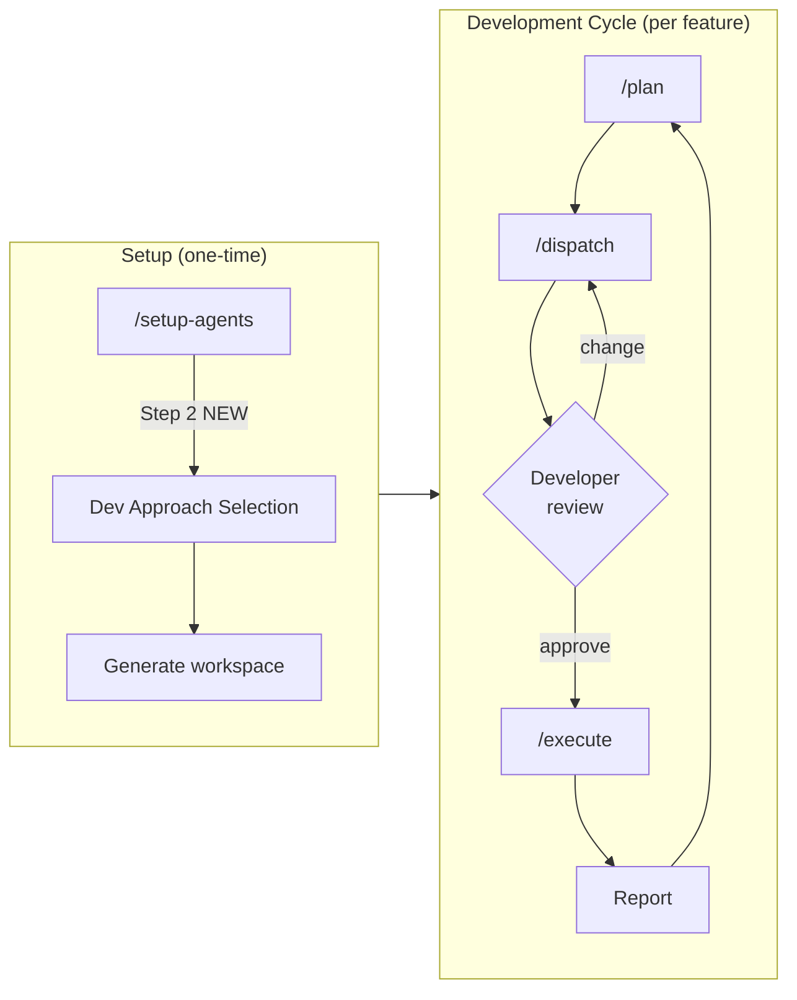
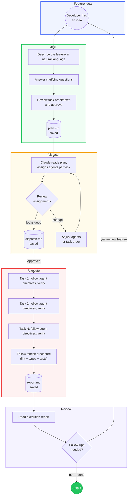
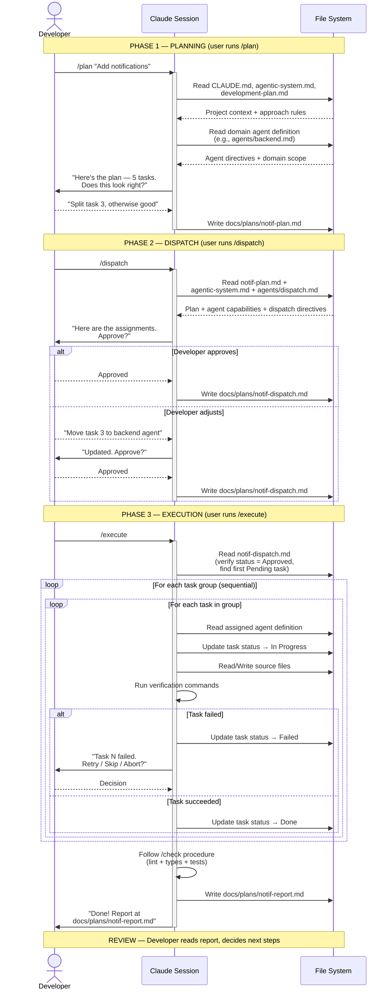
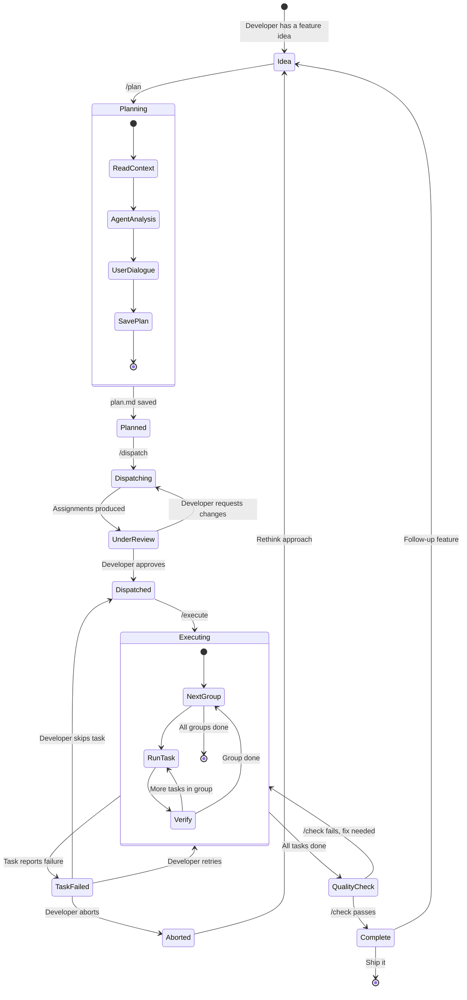
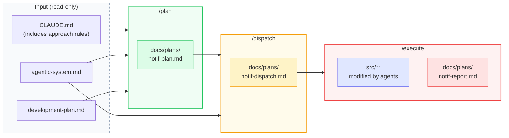

# Forgeline — Post-Setup Orchestration & Development Approach

**Date:** 2026-03-23
**Updated:** 2026-03-24
**Status:** Approved (v2 — revised after architectural review)
**Depends on:** [Forgeline Design Spec (2026-03-22)](2026-03-22-forgeline-design.md)

---

## Problem

After `/setup-agents` generates the workspace, the developer is left with agents, skills, and docs — but no structured workflow for day-to-day feature development. The current `/phase` skill reads a static plan and executes linearly. This breaks down in practice:

- Developers manually decompose features into tasks
- Agent assignment is implicit ("figure out who does what")
- No audit trail — what was planned vs. what was executed
- Development methodology is hardcoded (waterfall-ish phases)

---

## Solution Overview

Two new systems that work together:

1. **Task Orchestration** — a 3-skill pipeline (`/plan` → `/dispatch` → `/execute`) that structures feature development into plan → assign → run → report
2. **Development Approach Layer** — a new step in the `/setup-agents` dialogue that lets the user pick a methodology, generating approach-specific rules in CLAUDE.md



### How Skills and Agents Work in Claude Code

> **Important context for reading this spec.** Claude Code runs a single session at a time. When this spec says a skill "follows the dispatch agent's directives," it means Claude — within the same session — reads the agent definition file and follows its instructions. There is no separate process, no inter-process communication, and no automatic model switching. Each skill is a separate user-initiated command (`/plan`, `/dispatch`, `/execute`). The pipeline is a recommended manual workflow, not an automated chain.
>
> Similarly, when a skill references running another skill's procedure (e.g., "follow `/check` procedure"), this means executing those steps inline within the current session, not invoking a separate skill.
>
> The `model` field in agent definitions is a recommendation for which model to use when working with that agent, not a runtime directive. The actual model is determined by the user's session configuration.

---

## Part 1: Task Orchestration System

### Core Principle

**Nothing executes without manual approval.** The system automates the boring parts (decomposition, assignment, progress tracking) while the developer stays in control at every transition.

### The Pipeline

```
/plan                    /dispatch                  /execute
┌──────────────┐        ┌──────────────┐           ┌──────────────┐
│ User + Claude│───────▶│ Claude reads │──review──▶│ Task-by-task │
│ create plan  │        │ dispatch     │           │ execution    │
│              │        │ agent def,   │           │              │
│ Output:      │        │ assigns tasks│           │ Output:      │
│ plan.md      │        │ Output:      │           │ report.md    │
│              │        │ dispatch.md  │           │              │
└──────────────┘        └──────────────┘           └──────────────┘
```

---

### `/plan` — Planning Session

**Purpose:** User and Claude (following domain agent directives) collaborate to produce a human-readable feature plan.

**Input:** Feature description (free text from developer)

**Process:**

1. Read project context:
   - `CLAUDE.md` — architecture rules, constraints, and development approach
   - `docs/agentic-system.md` — available agents and their domains
   - `docs/development-plan.md` — current phase and progress

2. Identify the relevant domain agent based on feature scope (e.g., backend feature → read backend agent definition, full-stack → multiple agents listed)

3. Collaboratively decompose the feature:
   - Ask clarifying questions about scope, edge cases, dependencies
   - Propose task breakdown
   - User confirms or adjusts

4. Generate a URL-safe slug from the feature name: lowercase, replace spaces with hyphens, remove special characters, truncate to 40 characters. If a file with that slug already exists in `docs/plans/`, append `-2`, `-3`, etc.

5. Write the plan to `docs/plans/<feature-slug>-plan.md`

**Output format:**

```markdown
# Plan: <Feature Name>

**Date:** <YYYY-MM-DD>
**Author:** <developer> + <domain agent>
**Approach:** <selected methodology>
**Phase:** <current development phase>

## Goal

<1-2 sentences: what this feature achieves>

## Tasks

| # | Task | Domain | Depends on | Acceptance criteria |
|---|------|--------|------------|---------------------|
| 1 | ... | backend | — | ... |
| 2 | ... | frontend | 1 | ... |
| 3 | ... | testing | 1, 2 | ... |

## Risks

- <risk 1: what could go wrong and mitigation>

## Out of scope

- <what this feature explicitly does NOT include>
```

**Key rules:**
- The plan is human-readable, not machine-parseable — developers review it as a document
- Tasks must be small enough to complete in one Claude session
- Each task has a single domain owner (maps to one agent)
- Dependencies are explicit — no implicit ordering
- The approach rules in CLAUDE.md naturally influence how Claude structures tasks

---

### `/dispatch` — Agent/Skill Assignment

**Purpose:** Translate the human plan into a machine-readable dispatch with concrete agent and skill assignments.

**Input:** An existing `<feature>-plan.md` file. If multiple plan files exist in `docs/plans/`, present a list and ask the developer which one to dispatch.

**Process:**

1. Read the plan from `docs/plans/<feature>-plan.md`

2. Read system capabilities:
   - `docs/agentic-system.md` — agent names, domains, verification commands
   - Available skills and their triggers

3. Follow the **dispatch agent's directives** (read `agents/dispatch.md` and apply its rules within the current session)

4. Produce assignments:
   - For each task: which agent executes, which skills run before/after
   - Execution order respecting dependencies from the plan
   - Independent groups — tasks with no mutual dependencies that can be executed in any order within the group

5. **GATE: Present dispatch for developer review**
   - Show the full assignment table
   - Highlight any decisions that need human input (ambiguous domain, conflicting dependencies)
   - Wait for explicit approval

6. On approval: save to `docs/plans/<feature-slug>-dispatch.md`

**Output format:**

```markdown
# Dispatch: <Feature Name>

**Plan:** `<feature>-plan.md`
**Date:** <YYYY-MM-DD>
**Status:** Approved | Pending

## Execution Order

### Group 1 (independent)

| Task | Agent | Pre-skills | Post-skills | Status |
|------|-------|------------|-------------|--------|
| 1. Setup DB schema | backend | — | /check | Pending |
| 2. Create API types | backend | — | — | Pending |

### Group 2 (after Group 1)

| Task | Agent | Pre-skills | Post-skills | Status |
|------|-------|------------|-------------|--------|
| 3. Implement endpoints | backend | — | /check | Pending |
| 4. Frontend components | frontend | — | /check | Pending |

### Group 3 (after Group 2)

| Task | Agent | Pre-skills | Post-skills | Status |
|------|-------|------------|-------------|--------|
| 5. Integration tests | testing | — | /check | Pending |

## Notes

- <reasoning for non-obvious assignments>
```

**Key rules:**
- The dispatch NEVER modifies the plan — it only assigns executors
- If a task doesn't map cleanly to one agent, the dispatch flags it for the developer
- Groups define independence: tasks in the same group have no dependencies on each other
- Developer can reassign any task before approving
- All tasks start with `Status: Pending`

---

### `/execute` — Guided Execution

**Purpose:** Run the approved dispatch plan task by task, producing a full execution report.

**Input:** An approved `<feature>-dispatch.md` file

**Process:**

1. Read dispatch from `docs/plans/<feature>-dispatch.md`
2. Verify dispatch-level status is `Approved` — refuse to run `Pending` dispatches

3. **Resume mechanism:** Scan task statuses in the dispatch file. Find the first task with status `Pending` or `In Progress`. If all tasks are `Done`/`Skipped`, skip to step 5 (quality check + report).

4. Execute groups in order:
   ```
   For each group:
     For each task in group:
       1. Update task status to "In Progress" in dispatch file
       2. Log: "Starting task N: <description>"
       3. Follow pre-skill procedures inline (if any)
       4. Read the assigned agent's definition and follow its directives
       5. Perform the work and run verification commands from agent definition
       6. Follow post-skill procedures inline (if any)
       7. Update task status to "Done" in dispatch file
       8. Record: files changed, verification output
       9. If failed:
          - Update task status to "Failed" in dispatch file
          - STOP, report failure, ask developer how to proceed:
            - Retry the task (reset status to Pending)
            - Skip and continue (update status to Skipped)
            - Abort execution
   ```

5. After all tasks complete:
   - Follow `/check` procedure inline (full quality pipeline: lint + types + tests)
   - Generate execution report
   - Save to `docs/plans/<feature-slug>-report.md`

**Output format:**

```markdown
# Report: <Feature Name>

**Plan:** `<feature>-plan.md`
**Dispatch:** `<feature>-dispatch.md`
**Date:** <YYYY-MM-DD>
**Status:** Complete | Partial | Failed

## Results

| # | Task | Agent | Status | Files changed | Notes |
|---|------|-------|--------|---------------|-------|
| 1 | Setup DB schema | backend | Done | 2 | — |
| 2 | Create API types | backend | Done | 1 | — |
| 3 | Implement endpoints | backend | Done | 3 | Added validation |
| 4 | Frontend components | frontend | Skipped | 0 | Blocked by missing design |
| 5 | Integration tests | testing | Done | 2 | 12 tests added |

## Quality Check

- Lint: pass
- Types: pass
- Tests: 47/47 passing

## Summary

<2-3 sentences: what was built, any deviations from the plan>

## Follow-up

- <any tasks that surfaced during execution and should be planned next>
```

**Key rules:**
- Execution is sequential — groups execute in order, tasks within a group execute one at a time (Claude Code runs one session)
- Every task records what files it changed — this is the audit trail
- Failed tasks do NOT automatically retry — developer decides
- Task status is persisted in the dispatch file, enabling resume across sessions
- The report is the single source of truth for what happened

---

### New Agent (Generated in Target Project)

#### Dispatch Agent

```yaml
name: dispatch
model: claude-sonnet-4-6  # recommendation — actual model depends on session
domain: "Task assignment and execution planning"
```

**Core Directives:**
1. Read the plan and the agentic-system.md to understand available agents
2. Assign each task to exactly one agent based on domain ownership
3. Group tasks by dependency level for ordered execution
4. Never modify the plan content — only add execution metadata
5. Flag ambiguous assignments for developer decision

**Owns:** `docs/plans/*-dispatch.md`
**Forbidden from:** source code, configs, agent definitions

> **Note:** The dispatch agent's behavior is also defined by the `/dispatch` skill template. The agent definition provides identity and constraints; the skill provides the workflow.

---

### New Templates (in Forgeline)

```
templates/
├── agents/
│   └── dispatch.md.hbs          — dispatch agent definition
├── skills/
│   ├── plan.md.hbs              — /plan skill (output format embedded)
│   ├── dispatch.md.hbs          — /dispatch skill (output format embedded)
│   └── execute.md.hbs           — /execute skill (output format embedded)
└── approaches/
    ├── iterative.md.hbs         — CLAUDE.md section content
    ├── shape-up.md.hbs          — CLAUDE.md section content
    ├── tdd.md.hbs               — CLAUDE.md section content
    ├── trunk-based.md.hbs       — CLAUDE.md section content
    └── yagni.md.hbs             — CLAUDE.md section content
```

> **Design decision:** Plan, dispatch, and report output formats are embedded directly in the skill templates, not stored as separate `templates/plans/*.hbs` files. This is because skills in the target project cannot access Forgeline's template directory at runtime. The system-architect renders the skill templates during generation, and the output formats become part of the generated skill files.

**Template variables (new):**

| Variable | Source | Used in |
|----------|--------|---------|
| `{{approach}}` | Step 2 dialogue | CLAUDE.md.hbs, development-plan.md.hbs, plan.md.hbs |
| `{{approachContent}}` | rendered approach template | CLAUDE.md.hbs |

> **Note:** The dispatch agent is included in the standard `{{agents}}` array — no separate `{{dispatchAgent}}` variable is needed.

---

### File Structure in Target Project (After Generation)

```
docs/
├── agentic-system.md            — updated with dispatch agent
├── development-plan.md          — adapted to selected approach
├── commands.md                  — updated with /plan, /dispatch, /execute
└── plans/                       — NEW: feature planning directory
    ├── <feature>-plan.md        ← /plan output
    ├── <feature>-dispatch.md    ← /dispatch output (with per-task Status)
    └── <feature>-report.md      ← /execute output
```

---

### Modified Existing Components

#### `/phase` → backward-compat wrapper

The current `/phase` skill (linear executor) is superseded by the 3-skill pipeline. Migration:

- `phase.md.hbs` is refactored to become a thin wrapper:
  1. Check if `docs/plans/` exists and has files
  2. If a pending dispatch exists → suggest running `/execute`
  3. If no plans exist → suggest running `/plan` to start
  4. If the project has no `docs/plans/` directory → execute the original linear phase logic (full backward compatibility)

#### `setup-agents/SKILL.md`

- Standard skill set expands: `/check`, `/changelog`, `/phase`, `/deploy-check` + **`/plan`, `/dispatch`, `/execute`** (7 skills total)
- Step 8 summary includes orchestration workflow description
- System architect generates dispatch agent alongside domain agents

#### `system-architect.md`

- Generation output adds `agents/dispatch.md`
- Generation output adds 3 new skills
- Generation output adds `docs/plans/` directory
- Generation output adds approach section in CLAUDE.md (if approach selected)
- Updated verification checklist includes orchestration files

#### `agentic-system.md.hbs`

- New section: "Development Workflow" with orchestration diagram
- Dispatch agent in the agents table
- `/plan`, `/dispatch`, `/execute` in the skills table

#### `CLAUDE.md.hbs`

- New conditional section: "Development Approach" with approach-specific rules (if approach selected)
- New section: "Development Workflow" explaining the plan → dispatch → execute lifecycle
- Reference to `docs/plans/` as the audit trail

---

## Part 2: Development Approach Layer

### Core Principle

**The methodology shapes the output, not the process.** The 7-step dialogue (now 8-step) stays the same. The selected approach generates a "Development Approach" section in CLAUDE.md, which Claude naturally follows in every session. No template injection into agents, hooks, or skills required.

---

### New Step in Dialogue: Step 2 — Development Approach

Inserted before the current Step 2 (Agents). The full dialogue becomes:

```
Step 1 — Project Understanding       (unchanged)
Step 2 — Development Approach         NEW
Step 3 — Agents                       (was Step 2)
Step 4 — Skills                       (was Step 3)
Step 5 — Plugins                      (was Step 4)
Step 6 — Hooks                        (was Step 5)
Step 7 — Permissions                  (was Step 6)
Step 8 — Final Confirmation           (was Step 7)
```

---

### Approach Selection Logic

1. Read project context from Step 1 (team size, project type, existing conventions)

2. Suggest one approach based on context:

   | Signal | Suggested approach |
   |--------|--------------------|
   | Solo developer, small project | Iterative + Timeboxing |
   | Team project, existing CI/CD | Trunk-Based |
   | Product with deadlines | Shape Up |
   | Greenfield, unclear scope | Iterative + Timeboxing |
   | Library/OSS | TDD-First |

3. Present all 5 approaches with descriptions — developer selects exactly one

4. Save selection as `{{approach}}` in the confirmed configuration

> **v0.3 scope:** Single-select only. Multi-approach composition (e.g., Iterative + TDD) is deferred to v0.4.

---

### Available Approaches

Each approach generates a "Development Approach" section in the target project's CLAUDE.md. Claude reads CLAUDE.md at the start of every session and naturally follows the rules defined there.

#### Iterative + Timeboxing

**Philosophy:** Ship working increments every 1-3 days. Each cycle has a tangible deliverable.

**CLAUDE.md rules:**
- Phases in development-plan.md are 1-3 day cycles, not milestones. Each phase name is a deliverable, not a category.
- When planning features (`/plan`), define a "done in N days" timebox for each task. Tasks that don't fit must be split.
- Execution reports should include cycle duration and whether the timebox was met.

**Phase structure example:**
```
| 1 | Auth flow (login + signup) | Pending | 2 days |
| 2 | Dashboard with data grid | Pending | 3 days |
| 3 | Export to CSV | Pending | 1 day |
```

#### Shape Up

**Philosophy:** 6-week build cycles, 2-week cooldown. Work on appetites (how much time we're willing to spend), not estimates.

**CLAUDE.md rules:**
- Phases are "bets" with appetite (1w, 2w, 6w). No infinite backlog — unbet work is discarded.
- When planning features (`/plan`), ask for appetite declaration upfront: "How much are we willing to spend on this?"
- Prefer scope reduction over incomplete features. If a task exceeds appetite, suggest scope cuts instead of timeline extensions.

**Phase structure example:**
```
| 1 | Bet: Real-time notifications | In Progress | Appetite: 2 weeks |
| 2 | Bet: Advanced search | Pending | Appetite: 1 week |
| — | Cooldown | — | 2 weeks |
```

#### TDD-First

**Philosophy:** Tests are written before implementation. Test coverage is the primary quality signal.

**CLAUDE.md rules:**
- Every feature task has an explicit "test first" step: write tests → run tests (expect fail) → implement → run tests (expect pass).
- Plans should include a "Test Strategy" section defining test types and coverage targets per task.
- Write tests before implementation — this is directive #1 for all work.

**Plan format addition:**
```markdown
## Test Strategy

| Task | Test type | Coverage target |
|------|-----------|-----------------|
| Auth flow | Integration | endpoints + middleware |
| Data grid | Unit + E2E | component rendering + user flow |
```

#### Trunk-Based

**Philosophy:** Single main branch, short-lived feature branches (max 1 day), feature flags for WIP.

**CLAUDE.md rules:**
- Tasks must be mergeable independently. No multi-day branches. Large features use feature flags.
- Commit after each logical change, not at end of session. After each completed task: commit and push.
- Branches older than 1 day should be flagged for review.

#### YAGNI/KISS

**Philosophy:** Build the minimum that works. Refactor only when a second similar case appears.

**CLAUDE.md rules:**
- Every task must justify why it can't be simpler. Apply a "Do we really need this?" gate.
- Prefer the simplest solution. Do not create abstractions for single use cases.
- Flag tasks that look like premature abstraction or over-engineering.
- Flag files over 300 lines or functions over 50 lines as potential complexity issues.

---

### Approach Content Templates

New directory in Forgeline:

```
templates/approaches/
├── iterative.md.hbs         — CLAUDE.md section: timebox rules
├── shape-up.md.hbs          — CLAUDE.md section: appetite rules
├── tdd.md.hbs               — CLAUDE.md section: test-first rules
├── trunk-based.md.hbs       — CLAUDE.md section: branch rules
└── yagni.md.hbs             — CLAUDE.md section: simplicity rules
```

Each template produces plain text content for a "Development Approach" section in the generated CLAUDE.md. The system-architect renders the selected approach template and injects the content into `CLAUDE.md.hbs` via the `{{approachContent}}` variable.

> **Why CLAUDE.md, not template injection?** Approaches could theoretically inject directives into each agent definition, add conditional hooks, and modify skill behavior. But this requires a complex composition mechanism at the Handlebars level that is not well-defined. Instead, CLAUDE.md is the natural place for project-wide rules — Claude reads it at the start of every session and follows it. Zero template composition complexity. The approach rules apply universally without per-file injection.

---

## Full Dialogue Flow (Updated)

```
Step 1 — Project Understanding
  ↓
Step 2 — Development Approach          ← NEW
  │  Present approach suggestions based on context
  │  Developer selects one approach
  ↓
Step 3 — Agents                         ← includes dispatch agent
  ↓
Step 4 — Skills                         ← includes /plan, /dispatch, /execute
  │  Standard set now 7 skills instead of 4
  ↓
Step 5 — Plugins                        (unchanged)
  ↓
Step 6 — Hooks                          (unchanged)
  ↓
Step 7 — Permissions                    (unchanged)
  ↓
Step 8 — Final Confirmation             ← summary includes approach + orchestration
  │  On approve → system-architect generates everything
  ↓
Done — workspace ready, developer runs /plan to start first feature
```

---

## Complete Generated Output (Updated)

```
.claude/
├── settings.json               — hooks, deny permissions
└── settings.local.json         — allow permissions, MCP servers

agents/
├── <domain>.md                 — one per confirmed domain agent
└── dispatch.md                 — task assignment agent (NEW)

skills/
├── check/SKILL.md              — quality pipeline
├── changelog/SKILL.md          — session changelog
├── phase/SKILL.md              — backward-compat wrapper (MODIFIED)
├── deploy-check/SKILL.md       — pre-deployment audit
├── plan/SKILL.md               — planning session (NEW)
├── dispatch/SKILL.md           — agent/skill assignment (NEW)
└── execute/SKILL.md            — guided execution (NEW)

CLAUDE.md                       — architecture rules + approach section + workflow docs
docs/
├── agentic-system.md           — system docs with orchestration diagram
├── development-plan.md         — adapted to selected approach
├── commands.md                 — updated command reference
└── plans/                      — feature planning directory (NEW)
```

---

## Developer Experience: Day-to-Day Cycle

After `/setup-agents` completes, the developer's workflow looks like this:

### DX Flow — What the Developer Sees



### Under the Hood — Single Session Flow



### Feature Lifecycle — State Machine



### File Flow — What Gets Created When



**Time per cycle:** depends on feature size, but the overhead per cycle is minimal — `/plan` takes 2-5 minutes of dialogue, `/dispatch` is mostly automated with one approval gate.

---

## Key Constraints

1. **All 3 skills are opt-in.** A developer can always work directly with agents without the pipeline. The skills are accelerators, not gatekeepers.
2. **Plans are documentation, not code.** All plan files live in `docs/plans/` and are human-readable markdown. They can be reviewed in PRs, referenced in issues, and read by new team members.
3. **Dispatch never auto-executes.** The transition from `/dispatch` to `/execute` always requires manual approval. This is non-negotiable.
4. **Approach selection can be changed by re-running `/setup-agents`.** It's a project-level decision, not a per-feature decision. A standalone `/setup-approach` skill is planned for v0.4.
5. **Templates remain the source of truth.** All new content comes from `templates/`. The approach content, skill behaviors, and agent definitions are all Handlebars templates.
6. **Backward compatibility.** Projects generated before orchestration was added continue to work. `/phase` remains functional as a thin wrapper.
7. **Single session reality.** All agent "invocations" happen within a single Claude session. Skills are separate user-initiated commands. The pipeline is a recommended manual workflow.

---

## Deferred to v0.4

The following features were evaluated and intentionally deferred:

- **Documentation agent** — a dedicated agent for maintaining system docs and generating diagrams. Deferred because it was only used in one place (report formatting) and its scope constraints conflicted with required file access.
- **`/setup-approach` skill** — standalone approach reconfiguration without re-running `/setup-agents`. Deferred because partial regeneration of approach-dependent file sections is fragile and requires clear boundary definitions.
- **Multi-approach composition** — selecting 2-3 approaches and merging their effects. Deferred because template-level composition (merging directives, resolving hook conflicts) is not yet specified.
- **Custom approach (free text)** — describing a methodology in free text for the system architect to extract. Deferred as an unbounded generation problem.
